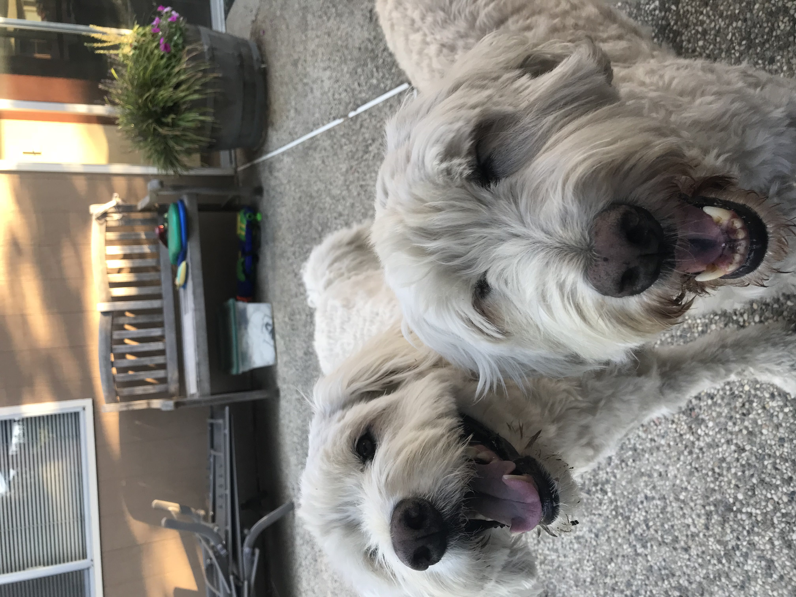
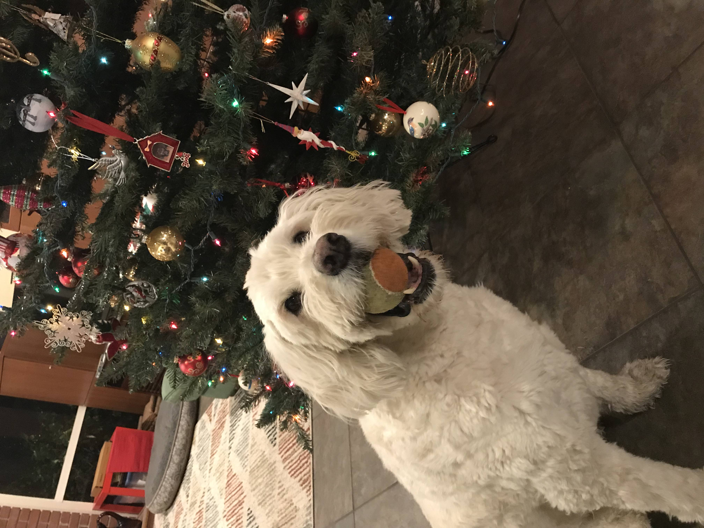

# Patrick Brown


### Software Engineer, Student

##### Table of Contents
[Introduction](https://github.com/PatrickBrown1/cse110-lab1/blob/main/index.md#introduction)
[My Skills](https://github.com/PatrickBrown1/cse110-lab1/blob/main/index.md#my-skills)
[Task List](https://github.com/PatrickBrown1/cse110-lab1/blob/main/index.md#task-list)

##### Introduction
Hello! My name is Patrick, and I am a third year Computer Science Major at UC San Diego! I've been absolutely *loving* my time here at UCSD! So many beaches to visit, people to meet, things to learn, and most importantly, **food** to eat! In my free time, I like to bake, listen to music (check out my [spotify profile](https://open.spotify.com/user/226e7cz4cgmyny63rpve67uli?si=97f6a1f657b74d20)), and work out.

> I just drink regular drip coffee, but I'm kind of a coffee baby. -Samin Nosrat


##### My Skills
Through my various projects I've learned quite a few skills, like
- React JS
- Rails
- Jest
- And many more!

My top 3 favorite programming languages are
1. Java
2. Python
3. JavaScript

My favorite algorithm is BogoSort, which you can see below (NOTE: THIS IS NOT MY CODE, SOURCE IS BELOW)
```
# Python program for implementation of Bogo Sort
import random
 
# Sorts array a[0..n-1] using Bogo sort
def bogoSort(a):
    n = len(a)
    while (is_sorted(a)== False):
        shuffle(a)
 
# To check if array is sorted or not
def is_sorted(a):
    n = len(a)
    for i in range(0, n-1):
        if (a[i] > a[i+1] ):
            return False
    return True
 
# To generate permutation of the array
def shuffle(a):
    n = len(a)
    for i in range (0,n):
        r = random.randint(0,n-1)
        a[i], a[r] = a[r], a[i]
```
(Source: https://www.geeksforgeeks.org/bogosort-permutation-sort/)

##### Task List
- [X] Headings
- [X] Styling text
- [X] Quoting text
- [X] Quoting code
- [X] External Links (Spotify in about)
- [X] Section links
- [X] Relative links ([secret dog link right here don't tell anyone](images/dogs/hiddendogpic.JPG))
- [X] Ordered and Unordered Lists
- [X] Task lists


*In case you were having a bad day, here are some pictures of my dogs!*




